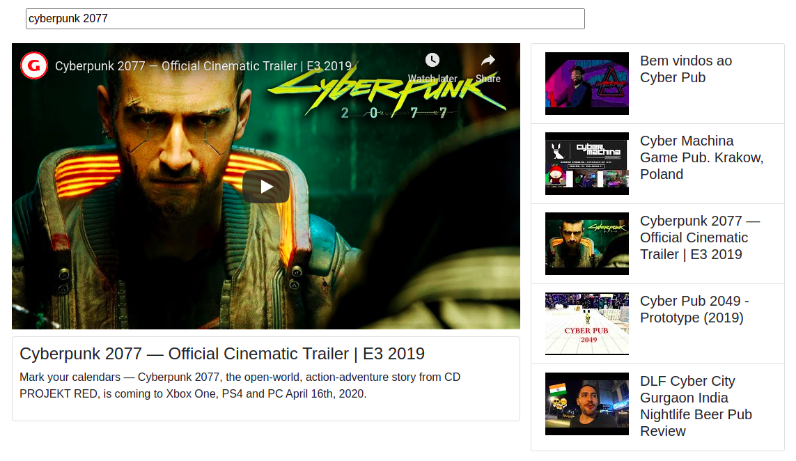

# video-browser

Simple app using components, events, props and Axios for Youtube Data Api integration.

## Final Result



## Project setup
```
yarn install
```

Provide an **api key** for Youtube integration via `App#API_KEY`.

### Compiles and hot-reloads for development
```
yarn serve
```

### Compiles and minifies for production
```
yarn build
```

### Lints and fixes files
```
yarn lint
```

### Customize configuration
See [Configuration Reference](https://cli.vuejs.org/config/).
